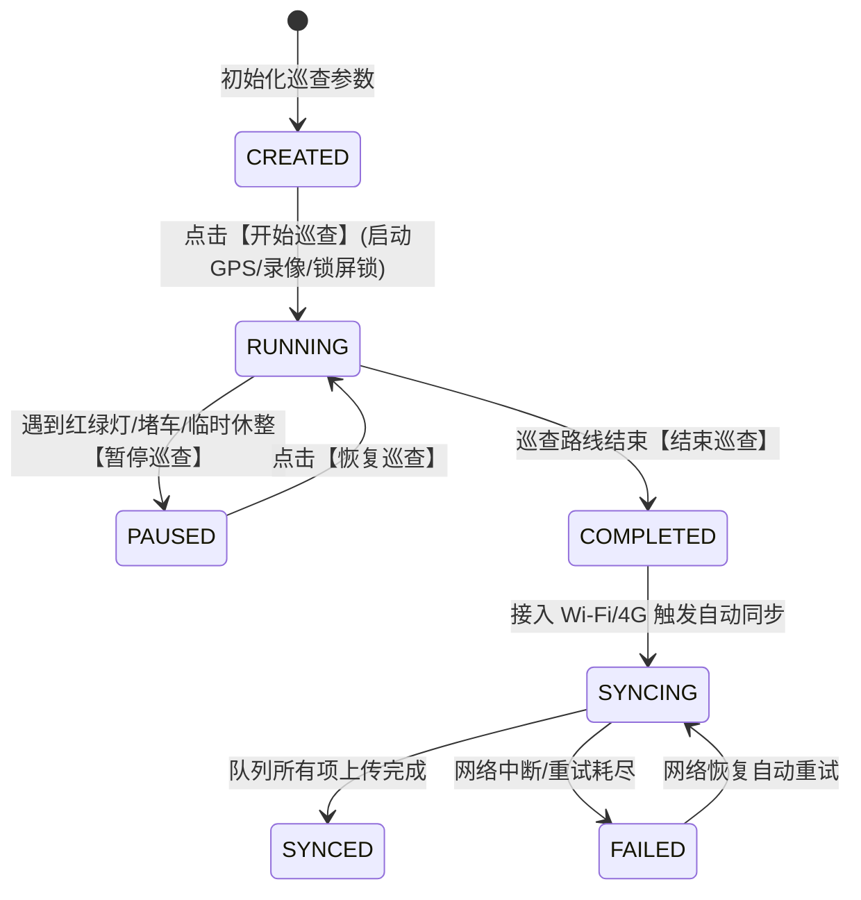

# 车载移动巡查端 (Mobile App) 架构设计

## 1. 架构目标与车载环境考量

车载移动巡查端专为道路巡线员在行车巡查场景下使用设计。
设备通常固定于挡风玻璃或副驾驶仪表台，面临震动颠簸、强光反射、网络时断时续、视线注意力需集中在路面上等极端苛刻的物理条件。

### 核心设计规范：
1. **驾驶安全第一**：界面严禁复杂表单输入或小字点击；操作核心为 **8 个超大尺寸高对比度触控按键**（触控靶区高度不小于 72px），支持盲按或余光一键标记。
2. **秒级轻量打点**：发现路产瞬间，单次点击即完成采集（自动打上当前坐标、车速、推算道路桩号、视频切片及对应时间偏移秒数），耗时 < 50ms。
3. **停车安全补录**：行车时不输入长文本；巡线员停车休息或到达服务区时，打开“停车安全补录”弹窗，补充多角度照片、病害严重程度与现场备忘。
4. **离线高可靠**：全功能支持 Android WebView / PWA / Capacitor / React Native 原生打包，离线持续采集无依赖。

---

## 2. 8 大核心触控按键布局

针对公路养护规范常见的道路附属设施，精选 8 类最高频对象：

```
+---------------------------+---------------------------+
|  🪧 交通标识牌            |  🚩 百米桩 / 里程碑        |
|  [TRAFFIC_SIGN]           |  [HUNDRED_METER_POST]     |
+---------------------------+---------------------------+
|  🛡️ 护栏设施              |  🌲 绿化林木              |
|  [GUARDRAIL]              |  [TREE]                   |
+---------------------------+---------------------------+
|  💡 道路路灯              |  🚘 交通工程设施          |
|  [STREET_LIGHT]           |  [TRAFFIC_FACILITY]       |
+---------------------------+---------------------------+
|  ⚠️ 异常 / 病害 (高亮警示) |  📦 其他附属设施          |
|  [DISEASE]                |  [OTHER]                  |
+---------------------------+---------------------------+
```

每个按键配备按压高亮反馈与语音/蜂鸣轻提示（视觉与听觉双重确认），巡查员无需低头细看屏幕。

---

## 3. 状态机迁移与生命周期控制

巡查会话采用 7 态严密生命周期状态机：



---

## 4. 视频切片录像与证据事件绑定机制

- **自动分段切片**：车载摄像头持续录像，每 5 分钟（300 秒）自动生成分段 MP4 切片（低单文件传输风险，切片损坏不影响全程）。
- **VideoEvent 强绑定**：每次点击路产采集按键，系统以纳秒级计算当前时间距离当前切片起始的偏移量 `video_offset_seconds`，生成 `VideoEvent` 证据实体：
  - `asset_id`: 关联路产 ID
  - `video_id`: 关联视频切片编号（如 `VID-PAT20260907-001`）
  - `event_type`: `ASSET_DETECTED`（正常发现） / `ANOMALY_FLAGGED`（病害告警）
  - `video_offset_seconds`: 帧秒数偏移
- 后台审核人员点击该路产时，GIS 地图与视频播放器自动跳帧至该精确秒数，直接呈现行车第一视角高清画面。
